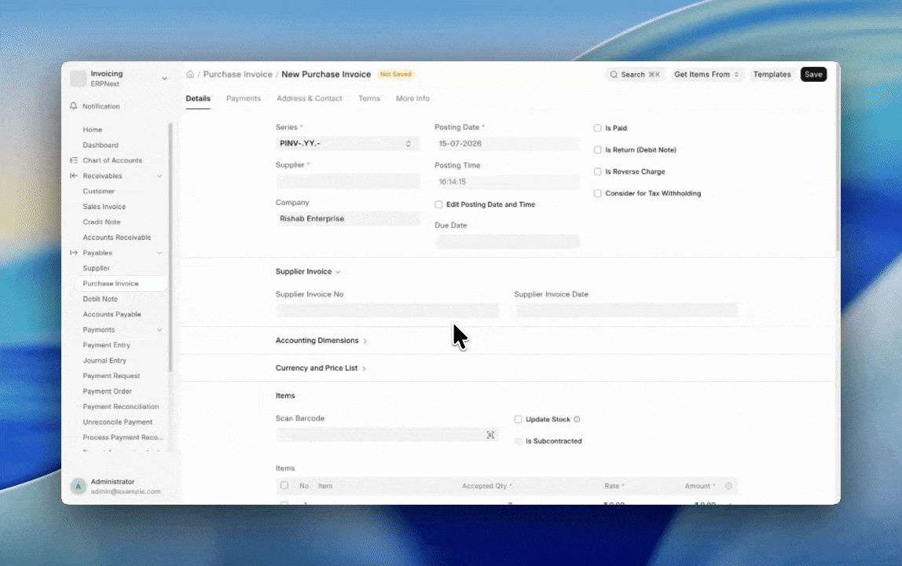
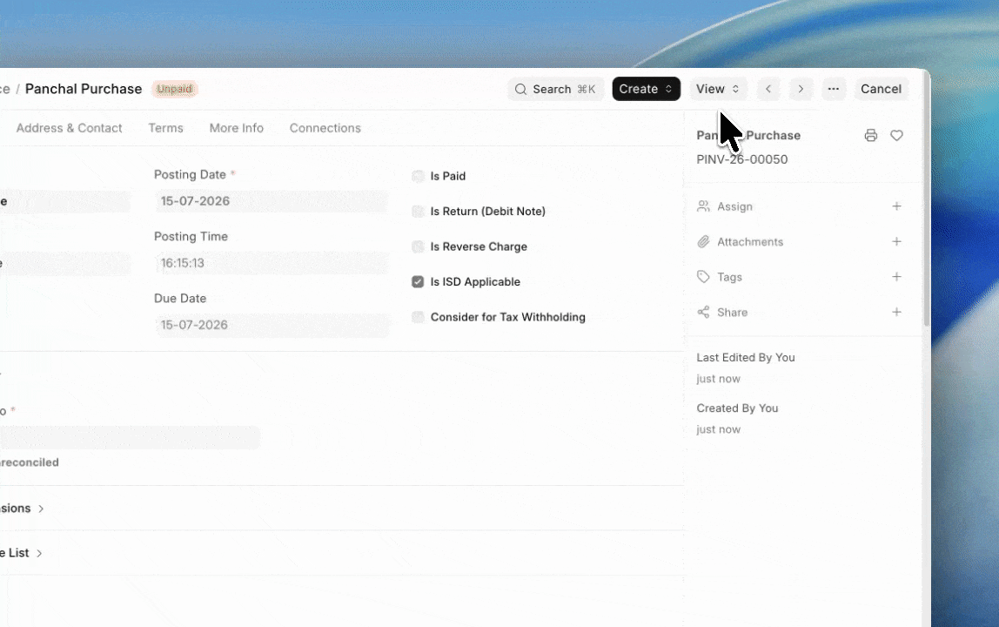
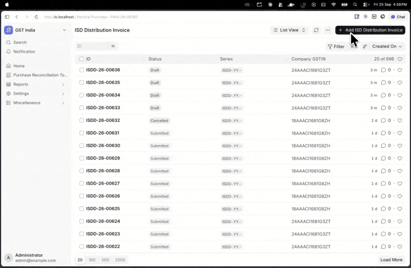
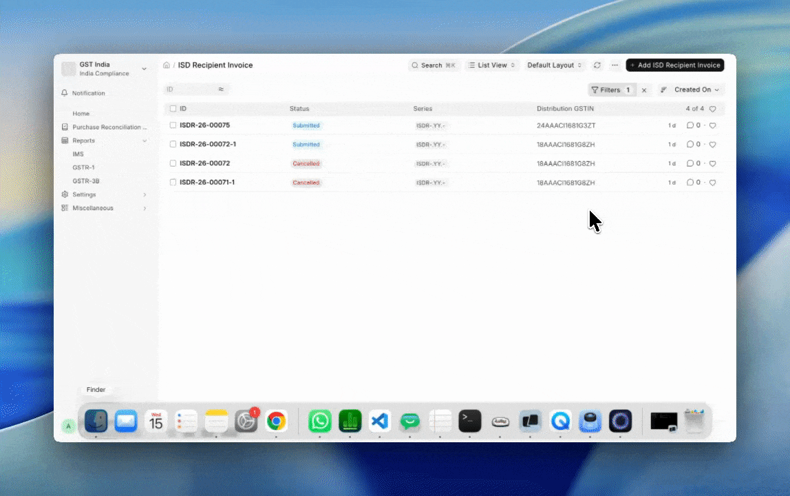

# Input Service Distributor (ISD)

An Input Service Distributor is the office that receives common input service invoices and passes the ITC on to its branches.

ITC distribution is recorded through two documents:

- ISD Distribution Invoice, on the distributor (head office / ISD) side
- ISD Recipient Invoice, on the recipient side

## Setting Up

To set up ISD, follow the steps:

1. Set the **Default ISD Provisional Account** in the Company.
2. Verify the following defaults in GST Settings:
    - **Distribute Expense with ISD Credit**: distributes the PI amount along with the taxes
    - **Auto Create ISD Recipient Invoice for Intra-Company Distributions** 
3. **Turnover Records** decide the distribution ratio. They are updated on each submission.
4. Create a Company Address with **GST Category** as **Input Service Distributor**.
5. Book the Purchase Invoices with this address as the Billing Address.

> Book separate Purchase Invoice for items with ineligible ITC.

## From Purchase Invoice

To distribute credit to multiple recipients at once, follow the steps:

1. Open the submitted Purchase Invoice with **Is ISD Applicable** enabled.
2. Click Create > ISD Distribution Invoices.
3. In the dialog:
    - Set the Posting Date.
    - Edit the recipient addresses. Remove non-recipient addresses here. 
    - Enter the **Turnover Amount (Prev. Yr.)** against each recipient address.

    ::: info Multi-company setup
    Check **Is Against Party**. Select the **Party Type**, **Party** (internal Customer / Supplier) and the recipient address.
    :::
4. Click **Create ISD Distribution Invoices**.
5. Review each draft that got created:
    - **Source Items**: item-wise split.
    - **Taxes**: ITC reduced on the distributor side.
    - **Distributed Expense**: expense being distributed.
    - **ISD Provisional Amount**: amount in the clearing account.
6. Submit the invoice.

    ::: info Multi-company setup
    The Recipient Invoice is not auto-created. Use Create > ISD Recipient Invoice. Verify the prefilled values and Submit.
    :::
7. Open the **Connections** tab to view the ISD Recipient Invoice.

## Direct Invoice Creation

1. Create a new ISD Distribution Invoice.
2. Add the Company, Distribution Address, Recipient Address and Posting Date.
3. Select the Purchase Invoice. **Source Items** gets autofilled.
4. Add the **Recipient Branch Turnover** and **Total Turnover** (sum of turnovers of all recipients).
5. Review **Source Items**.
6. Check **Taxes** for the impact on the distributor and on the recipient.
7. Submit the invoice.
8. The ISD Recipient Invoice is created and submitted automatically, if **Auto Create ISD Recipient Invoice for Intra-Company Distributions** is enabled in GST Settings.

::: info Multi-company setup
Check **Is Against Party**. Select the Customer / Supplier with its address. Create the recipient side through Create > ISD Recipient Invoice.
:::

## External Company

If your ISD is not managed in this ERPNext instance, create the ISD Recipient Invoice directly:

1. Leave the **ISD Distribution Invoice Reference** blank.
2. Enter the **External ISD Invoice Number**.
3. Fill in the source items and taxes.
4. Save and Submit.

## Credit Notes

To reverse a distribution, follow the steps:

1. Open the submitted ISD Distribution Invoice.
2. Click Create > Credit Note, and Submit.
3. Create the recipient side too.
